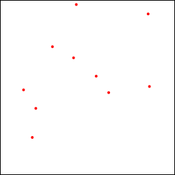
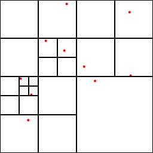

[Japanese](README_ja.md)/ English

# Sample code to construct a Barnes-Hut tree

## Summary

A sample implemantation of the [Barnes-Hut tree](http://arborjs.org/docs/barnes-hut) with Ruby. The Barnes-Hut tree is a quad-tree (octree in a 3D system) which is used for efficient simulations of n-body systems.

## Usage

    $ ruby barnes-hut.rb

It will provide the following two images.

Configuration of particles.

Divided quadrants.

It requires cairo package. If you do not have it, just run

    $ sudo gem install cairo

before execution.

## References

* [The Barnes-Hut Algorithm](http://arborjs.org/docs/barnes-hut)
* J. Barnes & P. Hut, Nature. 324 (4): 446–449. [A hierarchical O(N log N) force-calculation algorithm](http://www.nature.com/nature/journal/v324/n6096/abs/324446a0.html) The original paper of the Barnes-Hut algorithm published in Nature.
