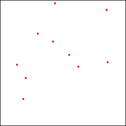
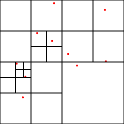

Japanese/ [English](README.md)

# Barnes-Hut treeの構築サンプル

## 概要

重力多体系の計算で使われる[Barnes-Hut tree](http://arborjs.org/docs/barnes-hut)を構築のサンプル。二次元版。

## 使い方

    $ ruby barnes-hut.rb

実行すると、粒子の初期状態`initial.png`と、分割した状態`barnes-hut.png`が出力される。

描画にcairoを使っているので、手元にない人は

    $ sudo gem install cairo

を実行すること。

粒子の配置。

分割後。

# 参考文献

* [The Barnes-Hut Algorithm](http://arborjs.org/docs/barnes-hut) これが一番わかりやすい解説だった。
* J. Barnes & P. Hut, Nature. 324 (4): 446–449. [A hierarchical O(N log N) force-calculation algorithm](http://www.nature.com/nature/journal/v324/n6096/abs/324446a0.html) Natureに掲載された元論文。
